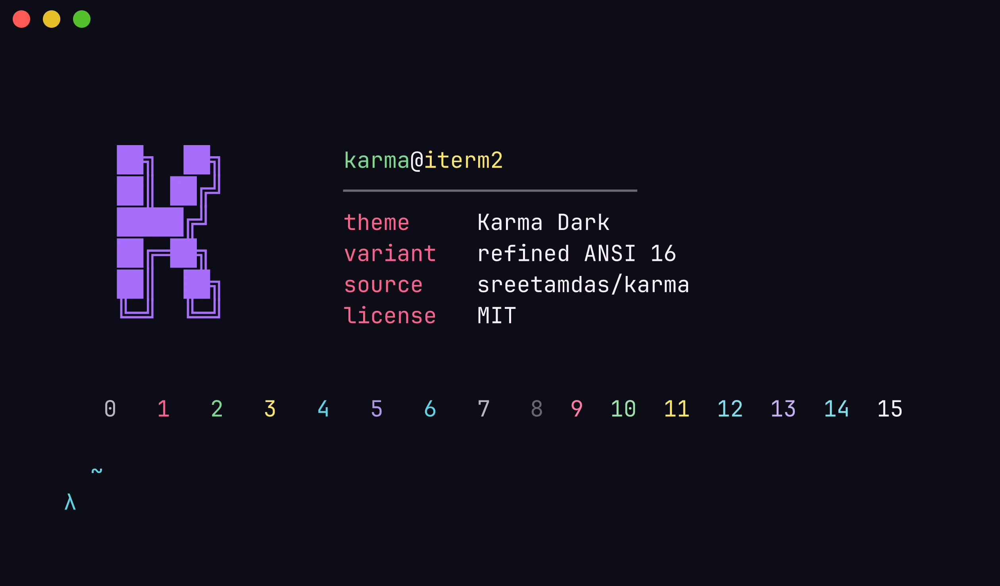
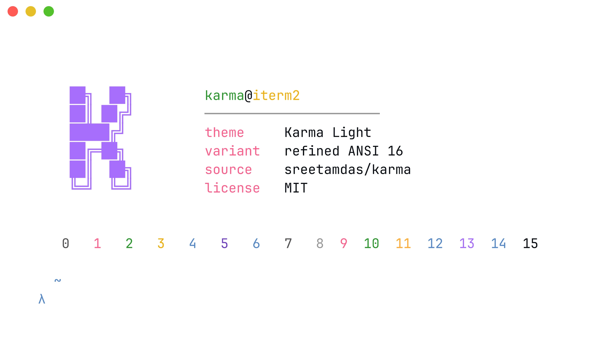

# iTerm2 Karma

[](https://github.com/aspatari/iterm2-karma/actions/workflows/ci.yml)
[](./LICENSE)

> [Karma](https://sreetamdas.com/karma) color theme by [Sreetam Das](https://github.com/sreetamdas) — ported to [iTerm2](https://iterm2.com).

Karma is a VS Code theme inspired by Ayu, Lucy, and Andromeda — vibrant accents on both dark and light backgrounds. This repository ports its palette into the `.itermcolors` format so your terminal matches your editor.

## Preview

<p align="center">
  
  <br>
  <em>🌙 Karma Dark</em>
</p>

<p align="center">
  
  <br>
  <em>☀️ Karma Light</em>
</p>

## Installation

1. Download the variant you want from [`colors/`](./colors):
   - [`karma-dark.itermcolors`](./colors/karma-dark.itermcolors)
   - [`karma-light.itermcolors`](./colors/karma-light.itermcolors)
2. Launch iTerm2 and open Settings (`⌘ + ,`).
3. Go to **Profiles** → select the profile you want to edit.
4. On the **Colors** tab, click **Color Presets** → **Import…**.
5. Pick the `.itermcolors` file you downloaded.
6. Open **Color Presets** again and select the imported preset.
7. Done. ✨

You can also grab pre-built `.itermcolors` directly from the [latest GitHub Release](https://github.com/aspatari/iterm2-karma/releases/latest).

## Variants

| Variant | File | When to use |
|---------|------|-------------|
| 🌙 Karma Dark | [`colors/karma-dark.itermcolors`](./colors/karma-dark.itermcolors) | Dark backgrounds (Karma's default) |
| ☀️ Karma Light | [`colors/karma-light.itermcolors`](./colors/karma-light.itermcolors) | Light backgrounds (Karma Light from VS Code) |

Both presets use the **refined ANSI 16 mapping** from the project's [`karma-palette`](./.opencode/skills/karma-palette/SKILL.md) reference — it sidesteps two quirks of Karma's verbatim `terminal.ansi*` ship values:

- **Dark:** `terminal.ansiBlue` and `ansiBrightBlue` are both set to orange in the upstream theme, which makes directories show as orange in `ls --color=auto`. The refined mapping uses Karma's cyan-blue instead.
- **Light:** `terminal.ansiBlack` is set to white (inverted ANSI 0/7 polarity), which breaks several CLI tools. The refined mapping uses dark for ANSI 0 and a mid-gray for ANSI 7.

## Recommended font

Karma's screenshots use [Iosevka](https://typeof.net/Iosevka/) (`Iosevka Term` or `Iosevka`). For the closest match to the original theme, configure the same font in iTerm2. Any other monospace font works correctly — the palette does not depend on the font.

## Building from source

The presets are produced by a Deno build script from a single TypeScript palette source in `src/palette/`. End users **do not need** Deno — both `.itermcolors` files are committed to the repository.

```bash
# Requires Deno >= 2.0
deno task build
```

The script generates files in `colors/` deterministically: a second run produces no changes (this is enforced in CI via `git diff --exit-code colors/`). Full pipeline:

```bash
deno task fmt:check    # formatting
deno task lint         # linting
deno task check        # type-check (strict mode)
deno task test         # 23 unit tests for the hex parser
deno task build        # generate both .itermcolors
```

The codebase follows a Layered + Functional Core / Imperative Shell pattern: `src/palette/` holds pure data, `src/render/` performs pure transformations, and `build.ts` is the only file that performs I/O. See the source comments and `AGENTS.md` for more.

## Screenshots

Recipe for reproducing the preview screenshots: [`assets/SCREENSHOTS.md`](./assets/SCREENSHOTS.md). The pipeline is fully automated — `freeze` renders the colored ANSI output of `assets/preview.sh` into a PNG without any GUI capture.

## References

- [sreetamdas/karma](https://github.com/sreetamdas/karma) — the original VS Code theme (MIT)
- [sreetamdas.com/karma](https://sreetamdas.com/karma) — theme demo page with examples in multiple languages
- [catppuccin/iterm](https://github.com/catppuccin/iterm) — repository structure and build-pipeline inspiration
- [iTerm2-Color-Schemes](https://github.com/mbadolato/iTerm2-Color-Schemes) — archive of `.itermcolors` themes (used for format validation)

## Acknowledgements

Huge thanks to [Sreetam Das](https://github.com/sreetamdas) for the original Karma theme. This port translates his palette into the iTerm2 format — every color choice and aesthetic decision is his.

The repository structure and build pipeline are inspired by [catppuccin/iterm](https://github.com/catppuccin/iterm).

## License

[MIT](./LICENSE) — compatible with the [original Karma project's license](https://github.com/sreetamdas/karma/blob/main/LICENSE.md).
